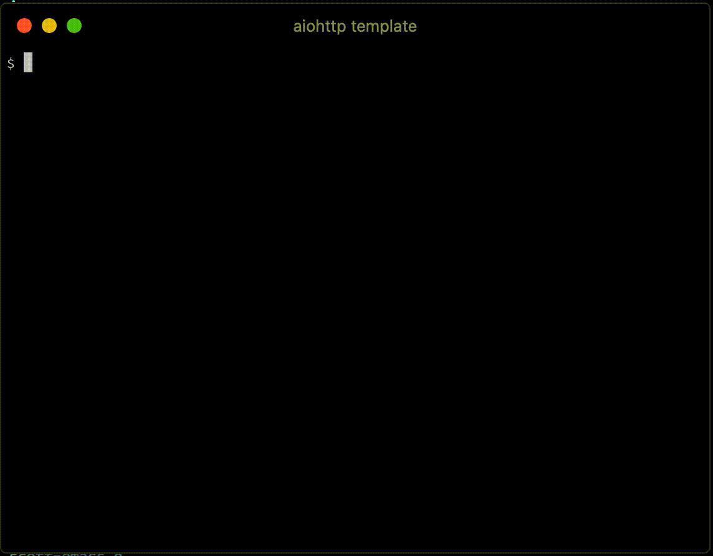

## aiohttp server template





install [cookiecutter](https://cookiecutter.readthedocs.io/)
```
pip install --user cookiecutter
```

Run this template to generate a project
```
cookiecutter gh:scotthaleen/aiohttp-template
```

Run from a specific branch
```
cookiecutter gh:scotthaleen/aiohttp-template -c branch_name
```

